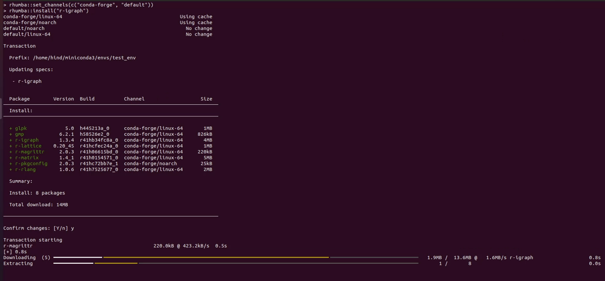

# Rhumba 🐍

Rhumba is a fast R package manager ⚡, powered by [mamba](https://github.com/mamba-org/mamba/).

It is still in early stages of development.

## Installation

With either `mamba` or `conda`:

`mamba install rhumba` or `conda install rhumba`

## Use

You can use `rhumba` as your new package manager!

Set the channel you'd rather use:

`rhumba::set_channels(c("conda-forge", "default"))`

Try installing something:

`rhumba::install("r-igraph")`

You might need to setup your `root_prefix` if you're running `R` and `rhumba` from a conda installation:
`rhumba::set_config("root_prefix", "/path/to/prefix")`

It's already set if you're used `micromamba` to create your environment!



## Installation from source

### Requirements:

First make sure to have the following R packages:

- Rcpp
- Devtools

And the softwares:

- autoconf
- automake
- libtool
- nlohmann_json
- cpp-filesystem
- libmamba

These can be downloaded with mamba:
`mamba install -c conda-forge r-rcpp r-devtools nlohmann_json cpp-filesystem libtool libmamba`

On Windows, you also need to install the MinGW toolchain:

`mamba install -c msys2 m2w64-gcc m2w64-make m2w64-toolchain m2-libbz2 posix`

#### Windows, Mac and Linux:

Install packages:

```
install.packages("Rcpp")
install.packages("devtools")
```

### Setup:

Inside the R environment, first generate the bidinings required to call C++ functions from R functions adorned with `Rcpp::export`:

`Rcpp::compileAttributes()`

Then:

`devtools::install()`

And you're ready to use Rhumba!

## Testing

You can run `devtools::check()` inside your R environment as a sanity check. More information about this command's output [here](https://r-pkgs.org/r-cmd-check.html).

## License

We use a shared copyright model that enables all contributors to maintain the copyright on their contributions.

This software is licensed under the BSD-3-Clause license. See the LICENSE file for details.
